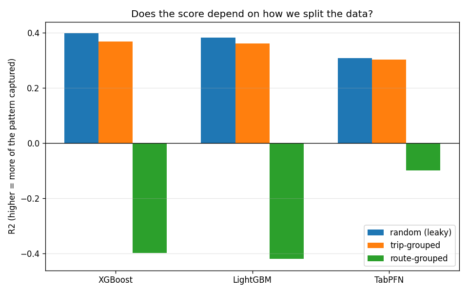

# Ferry Arrival Delay — TabPFN vs. XGBoost vs. LightGBM

A regression study on Sydney Ferries data (ICCL26): predict `arrival_delay`
(seconds late or early) from trip and weather features, compare three models on
accuracy and runtime, and check whether the results survive a leakage test.

**Headline finding:** the models look reasonable when the same routes appear in
train and test (R² ≈ 0.30–0.37), but R² goes **negative** for every model when
whole routes are held out. Much of the apparent accuracy is memorised per-route
behaviour, driven by `route_id` and `stop_id`.



## Results at a glance

R² under three ways of splitting train and test (all 21 features):

| Model | Random split (leaky) | Trip-grouped (default) | Route-grouped (stress test) |
|---|---:|---:|---:|
| XGBoost | 0.399 | 0.369 | −0.398 |
| LightGBM | 0.382 | 0.362 | −0.420 |
| TabPFN | 0.309 | 0.303 | −0.099 |

The full write-up, with the ablation study, temporal-feature experiment,
5-seed robustness check, and open issues, is in
**[docs/PROJECT_REPORT.md](docs/PROJECT_REPORT.md)** — start there.

## Repository layout

```
├── README.md
├── requirements.txt
├── docs/
│   ├── PROJECT_REPORT.md          Full project report (read this first)
│   └── PAPER_NOTES.md             Points and decisions to carry into the paper
├── notebooks/
│   ├── setup_tabpfn.ipynb         One-time TabPFN API login
│   ├── Ferry_Delay_Regression.ipynb   Main pipeline
│   └── Experiments.ipynb          Experiment sandbox
├── src/                           Scripted experiments, tables and figures
├── paper/                         Conference paper (Springer LNCS); see paper/README.md
├── data/
│   └── README.md                  How to obtain the dataset (not in the repo)
├── results/
│   ├── main_pipeline/             Baseline, scaling, importance, leakage splits
│   ├── ablation/                  Feature-ablation study
│   └── experiments/               Experiment log, temporal features, 5-seed check
└── figures/                       The five headline figures, numbered
```

| Notebook | What it does | Writes to |
|---|---|---|
| `Ferry_Delay_Regression.ipynb` | Cleaning, baseline models, scaling experiment, feature importance, leakage splits, ablation study. The finished pipeline — change it only deliberately. | `results/main_pipeline/`, `results/ablation/` |
| `Experiments.ipynb` | Self-contained sandbox for new experiments. Every run appends one row per model to `experiment_results.csv`. | `results/experiments/` |

## Getting started

1. **Clone and install** (Python 3.12):

   ```bash
   git clone <repo-url>
   cd <repo-folder>
   python -m venv .venv
   .venv\Scripts\activate          # macOS/Linux: source .venv/bin/activate
   pip install -r requirements.txt
   ```

2. **Get the data.** The CSV is not in the repository. Put it at
   `data/Data-Sydney 1.csv` — see [data/README.md](data/README.md).

3. **Set up TabPFN** (optional — XGBoost and LightGBM run without it). Run
   `notebooks/setup_tabpfn.ipynb` once to log in to the hosted TabPFN API. The
   token is stored on your machine by the client. **Never commit a token or a
   notebook output that prints one.**

4. **Run the notebooks** from the `notebooks/` folder, top to bottom. Paths are
   relative to that folder, so open them there rather than changing the working
   directory.

5. **Run the scripted experiments** from the repository root, e.g.
   `python src/run_stage2.py`. They append to
   `results/experiments/experiment_results.csv` and skip anything already
   logged, so they are safe to re-run.

## Things to know before you rely on the numbers

- **The dataset is probably truncated** at Excel's row limit. Unresolved.
- **Only 9 routes exist**, so the route-grouped result rests on few held-out
  groups. Trust its sign more than its exact size.
- **TabPFN's hosted API** caps context at about 10,000 rows (larger training
  sets are subsampled) and has a daily quota that long experiment runs can
  exhaust.
- XGBoost and LightGBM use matched, untuned defaults by design.

Details and next steps are in Sections 9–10 of the
[project report](docs/PROJECT_REPORT.md).

## Working together

- Add new experiments to `Experiments.ipynb`, not the main pipeline.
- `experiment_results.csv` is append-only; de-duplicate on
  `(experiment_name, feature_set, split_type, model, random_seed)` before
  analysing it.
- Work on a branch and open a pull request for anything that changes results.
